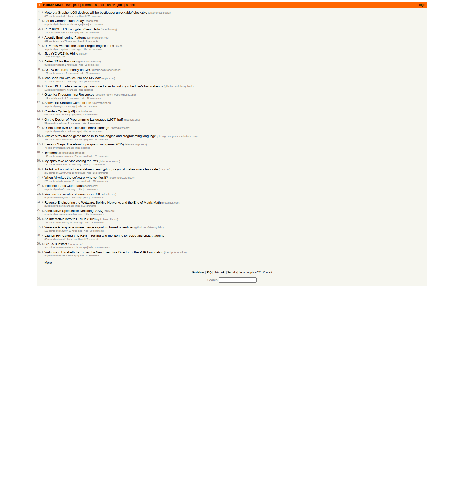

# Hacker News Trend Report — 2026-03-04

> Generated by Claude Code Bot on March 4, 2026

## Screenshot

---

## Top 10 Headlines

The following stories are ranked by HN front page position (excluding job postings), with point counts captured at time of scraping.

| # | Title | Points | Comments | Link |
|---|-------|--------|----------|------|
| 1 | Motorola GrapheneOS devices will be bootloader unlockable/relockable | 832 | 279 | [grapheneos.social](https://grapheneos.social/@GrapheneOS/116160393783585567) |
| 2 | Bet on German Train Delays | 45 | 30 | [bahn.bet](https://bahn.bet/) |
| 3 | RFC 9849. TLS Encrypted Client Hello | 117 | 53 | [rfc-editor.org](https://www.rfc-editor.org/rfc/rfc9849.html) |
| 4 | Agentic Engineering Patterns | 205 | 95 | [simonwillison.net](https://simonwillison.net/guides/agentic-engineering-patterns/) |
| 5 | RE#: how we built the fastest regex engine in F# | 34 | 11 | [iev.ee](https://iev.ee/blog/resharp-how-we-built-the-fastest-regex-in-fsharp/) |
| 6 | Better JIT for Postgres | 80 | 29 | [github.com/vladich](https://github.com/vladich/pg_jitter) |
| 7 | A CPU that runs entirely on GPU | 127 | 56 | [github.com/robertcprice](https://github.com/robertcprice/nCPU) |
| 8 | MacBook Pro with M5 Pro and M5 Max | 800 | 862 | [apple.com](https://www.apple.com/newsroom/2026/03/apple-introduces-macbook-pro-with-all-new-m5-pro-and-m5-max/) |
| 9 | Show HN: zero-copy coroutine tracer for scheduler's lost wakeups | 18 | — | [github.com/lixiasky-back](https://github.com/lixiasky-back/coroTracer) |
| 10 | Graphics Programming Resources | 114 | 12 | [gpvm-website.netlify.app](https://develop--gpvm-website.netlify.app/resources/) |

---

## Deep Dive: Top 3 Stories by Points

### 1. Motorola GrapheneOS Devices Will Be Bootloader Unlockable/Relockable — 832 pts

**Source:** [grapheneos.social](https://grapheneos.social/@GrapheneOS/116160393783585567) | **HN Discussion:** [279 comments](https://news.ycombinator.com/item?id=47241551)

This is a landmark moment for privacy-focused mobile computing. At **MWC 2026** in Barcelona, Motorola announced a formal partnership with the GrapheneOS Foundation — the first time a major OEM has officially collaborated with an open-source hardened Android project.

**Why it matters:**
- GrapheneOS has until now been exclusive to **Google Pixel** devices, chosen because Pixels allow bootloader re-locking after custom OS installation — a critical security requirement.
- Motorola is engineering future flagship devices to support both **unlocking and re-locking** the bootloader, meeting GrapheneOS's stringent verified boot requirements.
- The first compatible devices are planned for **2027**, targeting Motorola's Signature, Razr Fold, and Razr Ultra lines, as well as enterprise-oriented Edge and ThinkPhone models.
- Key GrapheneOS security features coming to Motorola include: PIN scrambling, duress passwords with remote wipe, and automatic reboot timers designed to defeat forensic extraction tools (e.g., Cellebrite).
- Motorola will offer select models **pre-loaded with GrapheneOS** as a factory option for enterprise customers, directly challenging Samsung Knox and Apple iOS in regulated industries.

**Significance:** This marks the beginning of a potential mainstream market for hardened, Google-free Android. The HN community's high engagement (832 pts, 279 comments) reflects both the security and privacy communities' excitement and broader interest in OS sovereignty.

---

### 2. MacBook Pro with M5 Pro and M5 Max — 800 pts

**Source:** [apple.com](https://www.apple.com/newsroom/2026/03/apple-introduces-macbook-pro-with-all-new-m5-pro-and-m5-max/) | **HN Discussion:** [862 comments](https://news.ycombinator.com/item?id=47232453)

Apple unveiled new 14-inch and 16-inch MacBook Pro models on **March 3, 2026**, powered by the M5 Pro and M5 Max chips, with pre-orders opening March 4 and shipping beginning March 11.

**Key highlights:**
- **New Fusion Architecture:** The M5 Pro and M5 Max are the first Apple silicon to bond two third-generation 3nm dies into a single package — a significant architectural departure from prior single-die designs.
- **CPU:** 18-core design (up from 14/16 cores in M4 generation) with six new "super cores," delivering up to **30% faster multithreaded performance** over M4.
- **AI performance:** A Neural Accelerator in every GPU core enables up to **4x AI performance** vs. M4, and up to **8x faster LLM prompt processing** than M1 Pro/Max.
- **Storage:** Starts at 1TB (M5 Pro) and 2TB (M5 Max); up to 2x faster SSD performance.
- **Connectivity:** Wi-Fi 7 and Bluetooth 6 via a custom Apple N1 wireless chip; Thunderbolt 5.
- **Battery:** Up to 24 hours.
- **Pricing:** 14-inch starts at $2,199 (M5 Pro) / $3,599 (M5 Max); 16-inch starts at $2,699 (M5 Pro) / $3,899 (M5 Max) — a notable price increase over M4 models.

The record comment count (862) suggests a community sharply divided between enthusiasm for the technical specs and frustration at escalating prices.

---

### 3. Claude's Cycles [pdf] — 656 pts

**Source:** [stanford.edu](https://www-cs-faculty.stanford.edu/~knuth/papers/claude-cycles.pdf) | **HN Discussion:** [279 comments](https://news.ycombinator.com/item?id=47230710)

In a remarkable paper dated **February 28, 2026** (revised March 2), legendary computer scientist **Donald Knuth** (age 87, Stanford) describes how **Claude Opus 4.6** solved an open mathematical problem he had been stuck on for weeks — one intended for a future volume of *The Art of Computer Programming*.

**The problem:** Construct a general rule for partitioning the vertex set of an m³-vertex directed graph into three Hamiltonian cycles for all odd m > 2. Knuth had solved the 3×3×3 case and verified computations up to 16×16×16 grids, but no general construction was known.

**How Claude solved it:** Knuth's colleague Filip Stappers ran **31 guided explorations** with Claude Opus 4.6 over roughly one hour. Claude:
- Tried brute-force searches and "serpentine patterns"
- Independently recognized the structure as a **Cayley digraph** (a classical group-theory concept)
- Discovered a pattern that maps to a classical **modular m-ary Gray code**
- Produced a compact construction verifiable as a short C program, valid for all odd m from 3 to 101

**Knuth's role:** Claude found the pattern; Knuth wrote the rigorous proof, generalized the result, and found exactly **760 "Claude-like" decompositions**. Knuth concluded: *"It seems that I'll have to revise my opinions about 'generative AI' one of these days. What a joy it is to learn not only that my conjecture has a nice solution but also to celebrate this dramatic advance in automatic deduction."*

**Caveat:** The even-numbered case remains unsolved — Claude "got stuck" and stopped producing correct code when Stappers pushed further.

---

## Trend Analysis

### Themes Emerging on HN — March 4, 2026

**1. AI Everywhere — Productivity, Verification, and Skepticism**
Multiple front-page stories reflect AI's expanding footprint and the community's nuanced reaction to it:
- *Claude's Cycles* celebrates a genuine mathematical breakthrough enabled by Claude Opus 4.6
- *Agentic Engineering Patterns* (Simon Willison, 205 pts) signals maturing best practices around AI agents
- *When AI writes the software, who verifies it?* (252 pts) raises formal verification concerns
- *My spicy take on vibe coding for PMs* (120 pts) and *GPT-5.3 Instant* (363 pts) reflect both enthusiasm and debate around AI-assisted development
- The HN community is increasingly focused on **AI verification and correctness** — not just capability

**2. Privacy and Security Hardware Are Mainstream Concerns**
The top story by points (Motorola + GrapheneOS, 832 pts) and the #3 story (RFC 9849 TLS ECH, 117 pts) both address foundational privacy infrastructure. The appetite for hardware-level privacy controls and encrypted metadata at the protocol layer is clearly growing beyond the security niche.

**3. Apple Silicon Still Commands Massive Attention**
The MacBook Pro M5 launch (800 pts, 862 comments — the highest comment count on the page) shows Apple hardware releases remain major community events. The AI-focused chip design narrative (Neural Accelerators per GPU core) ties directly to the broader AI theme.

**4. Systems Programming and Performance Engineering**
Multiple stories reflect deep interest in low-level performance:
- *Better JIT for Postgres* — database query compilation
- *RE#: fastest regex in F#* — functional language performance
- *A CPU that runs entirely on GPU* — creative architectural exploration
- *Show HN: zero-copy coroutine tracer* — scheduler debugging tooling

**5. Classic CS Resurfaces Alongside Modern AI**
*Claude's Cycles* (Knuth + Claude), *On the Design of Programming Languages (1974)*, and *An Interactive Intro to CRDTs* all point to a recurring HN pattern: renewed appreciation for foundational computer science, often triggered by contrast with AI-driven development.

**6. Tools for Distributed Collaboration**
*Weave – A language aware merge algorithm* (133 pts) and *CRDTs* (157 pts) suggest continued community interest in conflict-free, distributed state management — relevant to both AI-generated code review pipelines and collaborative editing.

---

*Report generated: 2026-03-04 | Data source: news.ycombinator.com front page*
